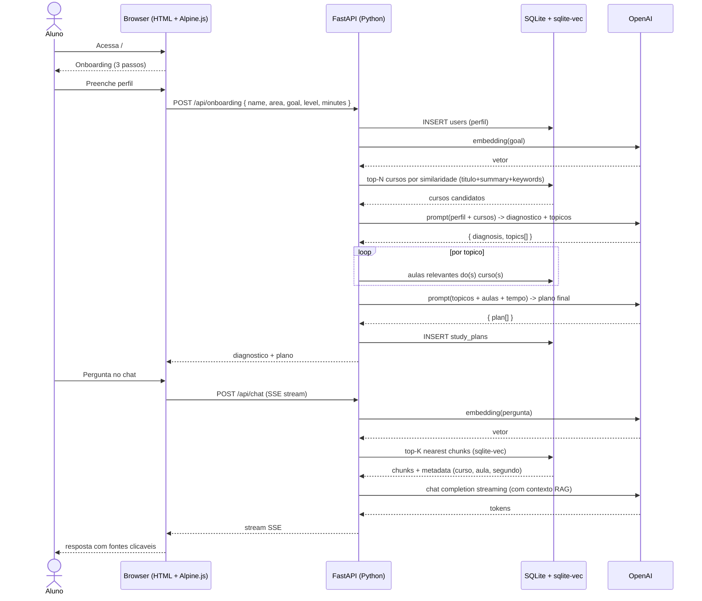
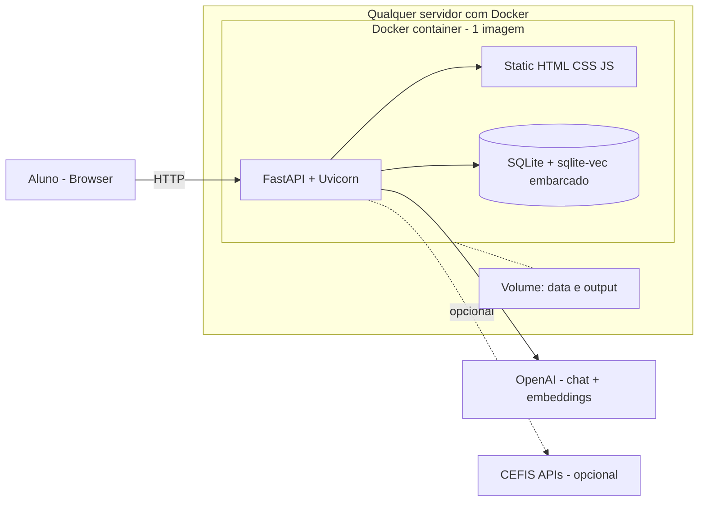
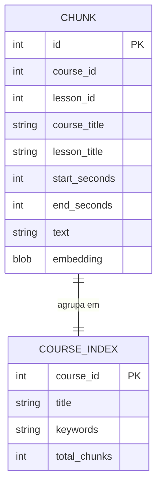

# Spec Logica — Tutor de Aprendizado com IA (CEFIS Hackathon)

> Status: **REV 2 — revisada com dados locais + stack Docker**
> Data: 2026-05-26
> Autor: Carlos Lima (solo)
> Documento de referencia: `Docs/CEFIS_Hackathon_Briefing.pdf`, `Docs/CEFIS_Hackathon_Docs_Dev.pdf`
>
> **Mudancas na rev 2:**
> - Descoberta: `courses.zip` ja extraido em `Docs/output/` contem **476 cursos, 12.172 aulas, 7.447 transcricoes VTT (55MB)**. Nao precisamos baixar `transcricoes.zip` do Drive.
> - Mudanca de stack: era Next.js + Vercel; passou para **Python + FastAPI + Docker** ("instala em qualquer servidor" — requisito explicito do usuario).
> - Login CEFIS deixa de ser obrigatorio (catalogo ja e local). Opcional como diferencial.

---

## 1. Origem e escopo

### Quem pediu e por que
- **Cliente:** CEFIS — Hackathon de Inovacao em Aprendizado (26/05/2026, 1 dia).
- **Motivacao:** desafio publico da CEFIS para prototipar um tutor IA que conheca o aluno, identifique lacunas e trace um plano personalizado integrado ao catalogo real da plataforma.
- **Premiacao:** R$ 10.000 para o vencedor + possibilidade de contratacao.

### O que VAI ser entregue (escopo minimo + 1 diferencial)
- **Onboarding:** coleta de perfil (nome via API CEFIS), area/profissao, objetivo declarado, nivel de conhecimento e tempo disponivel.
- **Diagnostico de lacunas:** a partir do objetivo e nivel declarados, a IA mapeia quais topicos o aluno ja domina e quais precisa aprender — cruzando com o catalogo CEFIS.
- **Plano de estudos:** lista priorizada e cronometrada de aulas/cursos da CEFIS (via API v3) + complementos gerados pela IA (resumo executivo, lista de pontos-chave) respeitando o tempo declarado.
- **Diferencial unico foco:** **Chat de duvidas com RAG** sobre as transcricoes reais das aulas (`transcricoes.zip`) — o aluno pergunta, o tutor responde citando a aula e o segundo de origem.

### O que NAO faz parte (cortes conscientes)
- **Sem geracao de audio/podcast** — fica para v2; nao da pra entregar bem em 1 dia solo.
- **Sem deteccao de estilo de aprendizagem** (visual/auditivo/cinestesico) — exige instrumento validado, alto risco.
- **Sem acompanhamento diario** — nao ha tempo de modelar progresso longitudinal.
- **Sem quiz/flashcards gerados** — pode entrar como stretch goal se sobrar tempo apos deploy.
- **Sem area administrativa, sem multi-tenant, sem analytics.**
- **Sem persistencia em banco proprio** — perfil do aluno fica no `localStorage` + via API CEFIS. Sem usuarios alem do logado.

### Fonte de dados, persistencia e parametros
| Item | Fonte | Persistencia | Observacao |
|---|---|---|---|
| Catalogo (cursos, aulas, professores) | `Docs/output/{course_id}/details.json` + `lessons/{pos}/details.json` (LOCAL) | Indexado em SQLite | 476 cursos, 12.172 aulas ja em disco |
| Transcricoes (RAG) | `Docs/output/{course_id}/lessons/{pos}/subtitle_pt.vtt` (LOCAL) | Indice vetorial em SQLite + sqlite-vec | 7.447 VTTs, ~55MB |
| Perfil de onboarding | Formulario do app | SQLite (tabela `users` local) | Cookie de sessao para retomar |
| Plano de estudos gerado | OpenAI `gpt-4o-mini` + retrieval do catalogo local | SQLite (tabela `study_plans`) | Regenerar a qualquer momento |
| Chat RAG | OpenAI + embeddings + sqlite-vec | Historico em memoria da sessao (opcional persistir) | Streaming via SSE |
| Login CEFIS (opcional) | `POST /api/v1/login` + `GET /api/v1/user/me` (cefis.com.br) | Cookie httpOnly | Diferencial: personalizar com nome real, mostrar certificados ja conquistados |
| URLs para o conteudo | `https://cefis.com.br/curso/{id}` (gerado, nao chamado) | — | Aluno clica para assistir na plataforma real |

### Decisoes que contrariam o CLAUDE.md global (sinalizadas para o revisor)
- **GOLD:** stack e **Python + FastAPI + Docker**, nao .NET / DevExtreme. Justificativa: requisito explicito do usuario "instala em qualquer servidor". Python tem melhor ecossistema de RAG. Docker = `docker compose up` em qualquer infra.
- **GOLD:** sem projeto de teste unitario. Justificativa: hackathon de 1 dia, esforco em testes nao compensa frente a features. Cobrimos com smoke test manual + checklist final.
- **GOLD:** sem stored procedures, sem EF, sem SQL Server. Persistencia e SQLite embarcado (vetores + perfis + planos).
- **GOLD:** sem build de frontend (sem npm, sem Vite, sem Next). Frontend e HTML estatico + Tailwind via CDN + Alpine.js — zero pipeline. Deploy = copiar arquivos.

---

## 2. Comportamento esperado

### Cenario principal (happy path)
1. **Aluno acessa a URL publica** (`http://servidor:8000/`, qualquer servidor que rode Docker).
2. **Tela de onboarding (3 passos)** — sem login obrigatorio:
   - Passo 1: nome + area de interesse (multiselect das 7 categorias CEFIS).
   - Passo 2: objetivo declarado (textarea livre — ex.: "passar na prova do CRC", "10 minutos para entender o maximo sobre astronomia").
   - Passo 3: nivel auto-declarado (iniciante/intermediario/avancado) + tempo disponivel total (slider 10min - 40h).
3. **Diagnostico:** sistema envia para a IA: perfil + objetivo + tempo + lista resumida de cursos do catalogo local relevantes (top N por busca semantica nos titulos/keywords/summaries). IA retorna:
   - Diagnostico em prosa curta (3-5 frases) do gap do aluno.
   - Lista de topicos a cobrir, em ordem.
4. **Plano de estudos:** com os topicos, sistema busca aulas especificas no catalogo local e a IA monta o plano final — sequencia de aulas com duracao acumulada respeitando o tempo declarado + 1 "resumo executivo" gerado pela IA por bloco tematico.
5. **Tela do plano:** aluno ve cards de aulas (titulo, professor, duracao, motivo "por que essa aula"), com botoes "marcar como concluida" e "assistir na CEFIS" (abre `cefis.com.br/curso/{id}` em nova aba).
6. **Chat lateral sempre disponivel:** "Tire suas duvidas sobre o conteudo". Aluno digita pergunta, sistema gera embedding, busca top-K chunks nas transcricoes via sqlite-vec, IA responde com streaming SSE e cita a aula+segundo de origem.
7. **Diferencial opcional (login CEFIS):** botao "Entrar com sua conta CEFIS" para puxar nome real + `is_premium` + certificados ja conquistados (`/performance/certificates`) — IA evita recomendar o que ja foi feito.

### Cenarios alternativos / edge cases
- **Aluno sem catalogo relevante para o objetivo** → IA explica que o catalogo CEFIS atual nao cobre bem aquele topico e sugere os cursos mais proximos + gera resumo executivo do tema com aviso de "conteudo gerado pela IA, nao do catalogo".
- **Tempo declarado < menor aula do catalogo** → IA gera apenas resumo + indica 1 aula mais curta.
- **Pergunta de chat sem cobertura nas transcricoes** (score abaixo do threshold) → IA responde "nao encontrei isso no material da CEFIS" + oferece resposta geral marcada como tal.
- **OpenAI fora do ar / rate limit** → mensagem "tente novamente em instantes"; nao quebra a UI; aluno mantem o plano ja gerado.
- **Login CEFIS falha** → desabilita o diferencial, mantem fluxo principal funcionando.
- **Indice nao construido ainda** → tela informa "preparando o tutor, aguarde X minutos" e exibe progresso.

### Regras de negocio
- **R1:** todo plano de estudos DEVE incluir pelo menos 1 conteudo real do catalogo CEFIS (criterio "Integracao CEFIS" 25pts).
- **R2:** se o tempo do aluno for < 30min, o plano e majoritariamente IA-gerada (resumos), com no maximo 1 aula real curta.
- **R3:** resposta do chat sempre cita fonte (titulo do curso + aula + segundo aproximado) quando vier de RAG.
- **R4:** chat NUNCA inventa nome de curso/aula que nao apareceu no retrieval — instrucao explicita no system prompt.
- **R5:** OPENAI_API_KEY fica so no servidor (variavel de ambiente lida pelo container, nunca exposta no HTML).
- **R6:** API Key da CEFIS (se usar) nunca vai pro client — passa pelo backend FastAPI.

---

## 3. Mapeamento de dados

### Fontes existentes USADAS (locais)
| Recurso | Origem | Uso no tutor |
|---|---|---|
| Detalhes do curso | `Docs/output/{id}/details.json` | Titulo, summary, goals, keywords, duracao, professor, categorias, rating |
| Detalhes da aula | `Docs/output/{id}/lessons/{pos}/details.json` | Titulo, posicao, duracao, URL do video |
| Transcricao da aula | `Docs/output/{id}/lessons/{pos}/subtitle_pt.vtt` | Texto + timestamps para RAG |

### Fontes existentes USADAS (remotas, OPCIONAIS)
| Recurso | Endpoint | Uso |
|---|---|---|
| Login | `POST cefis.com.br/api/v1/login` | Diferencial: personalizacao com conta real |
| Dados do usuario | `GET cefis.com.br/api/v1/user/me` | Nome real, area de atividade, premium |
| Certificados | `GET api-v3.cefis.com.br/performance/certificates` | Evitar recomendar conteudo ja concluido |

### Fontes CRIADAS (locais ao tutor)
| Recurso | Tipo | Conteudo |
|---|---|---|
| `data/cefis.db` | SQLite + `sqlite-vec` | Tabelas: `courses`, `lessons`, `chunks(id, course_id, lesson_id, start_seconds, end_seconds, text)`, `chunk_embeddings(chunk_id, embedding)` virtual via vec0; `users`, `study_plans`, `chat_history` |
| `data/index_state.json` | JSON | Status da indexacao (ultima execucao, contagem) |
| `app/` (FastAPI) | Codigo Python | Rotas: `/`, `/onboarding`, `/plan`, `/chat` (SSE), `/api/auth/login` (opcional CEFIS) |
| `static/` | HTML + CSS + JS | UI estatica: index.html, app.js, style.css. Tailwind via CDN. |

### Fontes ADAPTADAS
- Nenhuma. So leitura.

### Relacionamentos
- `courses.id` ↔ `lessons.course_id` (1:N)
- `lessons.id` ↔ `chunks.lesson_id` (1:N) — chave de join para citacao no chat
- `chunks.id` ↔ `chunk_embeddings.chunk_id` (1:1) via virtual table sqlite-vec
- `users.id` ↔ `study_plans.user_id` (1:N)

---

## 4. Diagramas

### 4.1 Fluxo principal (sequencia)

### 4.2 Arquitetura (deploy "instala em qualquer servidor")

### 4.3 Modelo de dados local (RAG)

---

## 5. Prototipo visual

**Arquivo:** `Docs/specs/prototipo.html` — abre direto no browser (Tailwind via CDN + Alpine.js, zero dependencia).

**Telas:**
1. **Onboarding** — wizard 3 passos com barra de progresso (sem login obrigatorio).
2. **Plano de estudos** — duas colunas: cards de aulas (esquerda 60%) + chat lateral (direita 40%).
3. **Estado de "preparando o tutor"** — barra de progresso mostrando indexacao em curso.

Esse HTML serve duplo proposito: validacao visual + base do frontend real (sera reaproveitado na implementacao).

---

## 6. Checklist de entrega (validacao final)

> Cada item sera marcado ✅ ou ⏳ no fim do dia. Auto-validavel (sim/nao).

### Obrigatorios (briefing)
- [ ] Onboarding coleta nome, area, objetivo, nivel e tempo disponivel
- [ ] Sistema gera diagnostico de lacunas em prosa
- [ ] Sistema gera plano de estudos com pelo menos 1 conteudo real do catalogo CEFIS
- [ ] Plano respeita o tempo declarado pelo aluno
- [ ] Chat de duvidas funciona com streaming
- [ ] Chat cita curso + aula + segundo de origem quando vem de RAG
- [ ] App roda em qualquer servidor com Docker (`docker compose up`)
- [ ] Hospedagem publica acessivel ao jurado
- [ ] Repo publico no GitHub atualizado
- [ ] README com instrucoes claras de instalacao + variaveis de ambiente

### Qualidade
- [ ] `docker compose up` sobe sem erro em maquina limpa
- [ ] Smoke test manual: onboarding → plano → chat (5min)
- [ ] OPENAI_API_KEY NUNCA aparece no HTML/JS do client
- [ ] Erro de OpenAI/rede nao quebra a UI (fallback gracioso)
- [ ] Indice das transcricoes pre-construido (script `make index`), nao indexa em runtime

### Stretch goals (so se sobrar tempo, ordem de prioridade)
- [ ] Geracao de quiz curto ao final do plano
- [ ] Marcar aula como concluida (persistir em `localStorage`)
- [ ] Pequeno dashboard de progresso (% concluido do plano)
- [ ] Modo demo sem login (perfil "convidado")

---

## 7. Riscos e mitigacoes

| Risco | Probabilidade | Impacto | Mitigacao |
|---|---|---|---|
| Indexacao das 7.447 VTTs demora demais | Alta | Critico | Comecar pelo indexador AGORA. Usar batch de 100 chunks por request a OpenAI. Estimativa: ~7M tokens / $0.14 / ~30min. |
| OpenAI rate limit no indexador | Media | Alto | Tier1: 500 RPM / 1M TPM em text-embedding-3-small. Batch async com asyncio + semaphore = OK. |
| OpenAI rate limit em runtime | Baixa | Medio | gpt-4o-mini tem cota generosa. Mostrar mensagem amigavel se 429. |
| Docker build quebra | Baixa | Critico | Image base oficial python:3.12-slim + uv. Testar build cedo (1a hora). |
| Hospedagem publica | Media | Critico | Plano A: Fly.io (free tier + Dockerfile + 1 comando). Plano B: Railway. Plano C: VPS proprio. |
| Stress / cansaco no fim do dia | Alta | Medio | Cronograma com buffer de 2h, parar de adicionar features apos 21h. |
| Indice ficar grande demais (>500MB) | Media | Medio | text-embedding-3-small = 1536 dims × 4 bytes × ~50k chunks ~= 300MB. Aceitavel. Se passar de 1GB, reduzir granularidade. |

---

## 8. Cronograma de 1 dia (referencia)

> Inicio assumido 09h (apos live), entrega 00h59 BRT do dia seguinte.

| Hora | Bloco | Entregavel |
|---|---|---|
| Agora-10h | Spec aprovada + prototipo HTML + indexador rodando em background | Spec OK, HTML aberto no browser, indexacao em curso |
| 10h-12h | Scaffold FastAPI + rotas estaticas + Dockerfile + smoke deploy | "Hello world" em container local funcionando |
| 12h-13h | Almoco + revisao do indice gerado | SQLite com chunks + embeddings |
| 13h-15h | Endpoint /onboarding + /plan (diagnostico + plano via OpenAI) | Telas 1 e 2 funcionais com dados reais |
| 15h-18h | Endpoint /chat com SSE + RAG via sqlite-vec | Diferencial pronto |
| 18h-20h | Polish UI + edge cases + citacoes clicaveis | UI presentavel |
| 20h-21h | Deploy publico (Fly.io / Railway) + smoke test | URL acessivel |
| 21h-22h | README + video curto de demo | Repo apresentavel |
| 22h-00h | Buffer / contingencia | — |

---

## 9. Aprovacao

Esta spec esta pronta para revisao. **Aguardo seu OK para:**
1. Ajustar pontos que voce queira mudar.
2. Gerar o **prototipo visual** das 3 telas (artifact HTML/React).
3. Avancar para a **spec tecnica** (arquivos, prompts, schemas, deploy).

---
