# Tutor IA CEFIS

Tutor de aprendizado personalizado construído para o **Hackathon de Inovação em Aprendizado da CEFIS** (26/05/2026).

Onboarding em 3 passos, mensagem contextual do tutor com áudio automático, plano cronometrado usando o catálogo real, chat com RAG sobre as transcrições das aulas, quiz por aula, áudio em todo conteúdo gerado, trilha evolutiva multi-fase, dashboard com Trajetória de Mestria e insights automáticos, welcome screen com retomada inteligente, loading dinâmico, chat por voz hands-free e roleplay aplicado para treinar argumentação em cenários reais.

🌐 **Acesse:** [https://tutor-cefis.duckdns.org](https://tutor-cefis.duckdns.org)

**Status:** 10/10 testes E2E (`scripts/test_endpoints.py`) + validação real no browser via Playwright headless. 20 rotas backend. Deploy público em Windows Server com IIS + Let's Encrypt.

---

## Documentação

| Documento | Conteúdo |
|---|---|
| [SETUP.md](SETUP.md) | Instalação e execução local (Windows) |
| [DEPLOY.md](DEPLOY.md) | Deploy em servidor Windows com IIS + nssm |
| [ARQUITETURA.md](ARQUITETURA.md) | Stack, fluxos, diagramas, decisões de design |
| [DATABASE.md](DATABASE.md) | Schema SQLite + sqlite-vec, queries-chave, estado da indexação |
| [PROXIMAS_FUNCIONALIDADES.md](PROXIMAS_FUNCIONALIDADES.md) | Roadmap pós-hackathon |
| [Docs/specs/01-spec-logica.md](Docs/specs/01-spec-logica.md) | Spec lógica (escopo + mapeamento de dados) |
| [Docs/specs/video-demo-roteiro.md](Docs/specs/video-demo-roteiro.md) | Roteiro do vídeo de apresentação |

---

## O que foi entregue

### Aprendizado ativo

**Roleplay aplicado — "Pratique com o tutor"**. O aluno escolhe um cenário real (apresentar PDCA para o CFO cético, defender planejamento tributário em auditoria, negociar prazo com cliente exigente, explicar IFRS 16 em treinamento interno). A IA interpreta o personagem com tom realista e faz perguntas. Após algumas trocas, o aluno recebe feedback estruturado com nota 0-10, pontos fortes, pontos a melhorar e 3 aulas reais do catálogo CEFIS linkadas para aprofundar. Funciona inteiramente por voz.

### RAG profundo nas transcrições

O catálogo completo foi indexado: 476 cursos, 12.172 aulas, 7.447 transcrições VTT, totalizando **34.422 chunks vetoriais** (sqlite-vec, 1536 dimensões). Quando o aluno pergunta no chat, o tutor responde citando **curso, aula e segundo exato** onde aquilo é dito. As citações são clicáveis e abrem o curso real em `cefis.com.br/curso/{slug}/{id}`.

### Tutor contextual

A "Mensagem do tutor" cita nominalmente o que o aluno já dominou em 2-3 frases, explica o que esta sessão entrega e fecha com uma frase conectando ao objetivo profissional declarado. O áudio toca automaticamente ao abrir a sessão.

### Trajetória de Mestria

Um conceito é marcado como dominado quando o aluno conclui a aula **e** acerta ≥80% no quiz da mesma aula. A métrica representa retenção observada, não presença. Insights automáticos baseados nos dados do próprio aluno: período do dia com melhor taxa de acerto, comparativo com a média semanal, taxa de retenção validada.

### Chat por voz hands-free

Web Speech API capta a pergunta em português, envia automaticamente e a resposta toca em voz alta via TTS. Permite uso do tutor sem mãos livres em contextos como ônibus, carro ou rotinas de exercício.

### Sessão recorrente "tenho X minutos agora"

Botão visível no header. O aluno informa o tempo atual e escolhe continuar o mesmo objetivo (fase N+1) ou trocar de tema. O histórico cumulativo garante que aulas já vistas são puladas automaticamente.

### Integração com a API CEFIS (5 endpoints)

- `POST /api/v1/login` — autenticação
- `GET /api/v1/user/me` — dados do usuário (nome, ocupação, áreas, premium)
- `GET /performance/certificates` — remove cursos já certificados do plano
- `GET /tracks` + `GET /tracks/:id` — 20 trilhas oficiais curadas pela CEFIS
- `GET /courses/:id/lessons` — progresso real em tempo real para "continuar de onde parou"

### Demais entregas

- **Welcome screen** com retomada inteligente para alunos que voltam
- **Loading dinâmico** com 12 etapas em pool (sorteia 4) + 12 dicas rotativas apresentando as features
- **Modal de conclusão de sessão** com opções "Praticar" / "Nova sessão"
- **Quiz dinâmico** gerado em runtime da transcrição real da aula
- **Áudio TTS** em todo conteúdo gerado pela IA (botão 🔊 em mensagem do tutor, resumos, chat, quiz)
- **Resumos com markdown rico** e diagramas Mermaid quando o tema é sequencial (PDCA, DMAIC)
- **Dashboard "Meu Progresso"** com cards de stats, distribuição por área, sessões recentes
- **Modo escuro** com toggle persistente
- **Logos CEFIS oficiais** em todas as telas
- **Perfil persistente** em localStorage (sobrevive a refresh, login, troca de aba)

### Bases arquiteturais

- Toda saída da IA aponta para uma aula real do catálogo (resumos linkam para "📎 Para se aprofundar", chat cita fontes clicáveis, quiz oferece "Assistir aula completa")
- Stack portável: Python + venv + nssm como serviço Windows; Dockerfile incluso como alternativa
- Frontend sem build: Tailwind e Alpine.js via CDN, deploy é cópia de arquivos
- Deploy real funcionando: Windows Server + IIS + URL Rewrite + ARR + Let's Encrypt em [tutor-cefis.duckdns.org](https://tutor-cefis.duckdns.org)

---

## Galeria de telas

<table>
  <tr>
    <td width="50%"><b>Onboarding em 3 passos</b><br/>Áreas inferidas do catálogo real (215 cursos de Fiscal & Tributário, 203 de Contábil, 123 de Gestão e Negócios, etc).<br/><br/>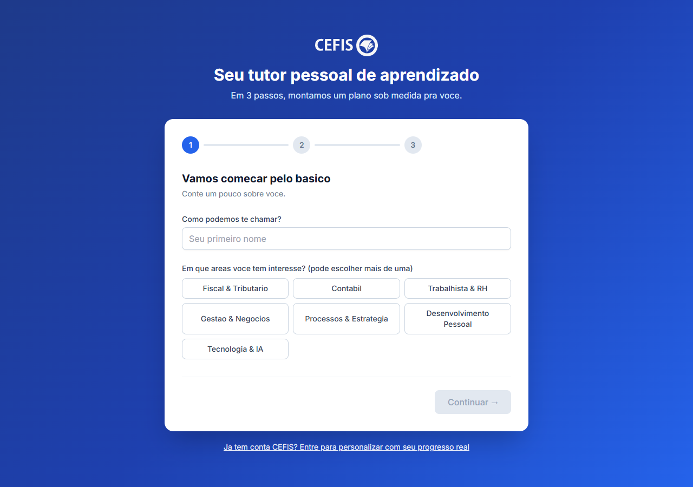</td>
    <td width="50%"><b>Objetivo livre</b><br/>O aluno escreve o que quer alcançar. Esse texto é a base do diagnóstico da IA.<br/><br/>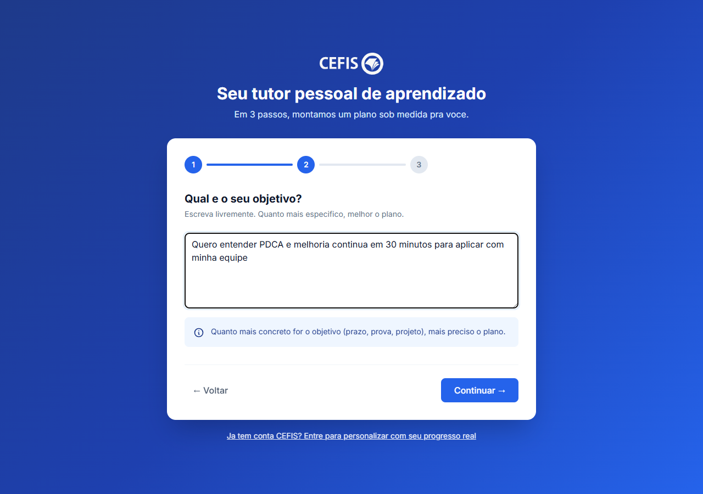</td>
  </tr>
  <tr>
    <td><b>Nível + tempo disponível</b><br/>Slider de 10 min a 40 h. O prompt do plano respeita o tempo declarado com tolerância de +10%.<br/><br/>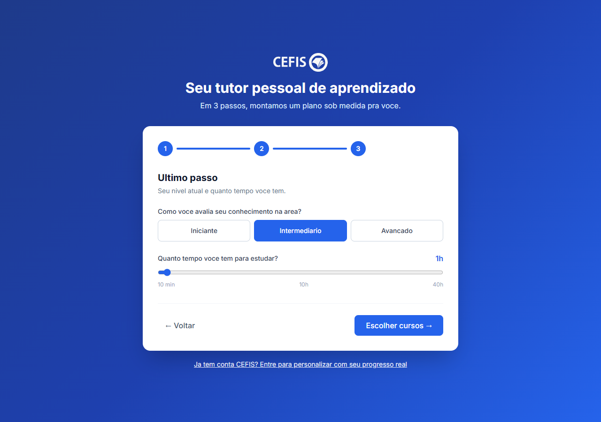</td>
    <td><b>Seleção manual dos cursos</b><br/>O aluno vê os 12 cursos mais relevantes (busca semântica) e escolhe quais quer. Atalho para trilhas oficiais da CEFIS no topo, via API real.<br/><br/>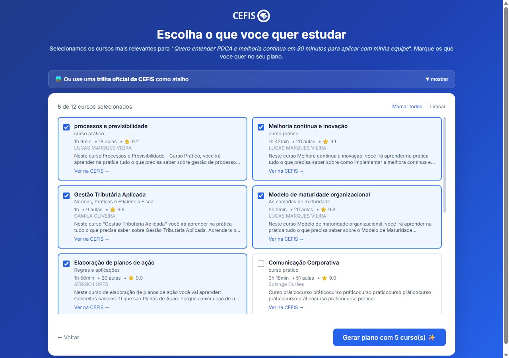</td>
  </tr>
  <tr>
    <td colspan="2"><b>Plano e chat com RAG</b><br/>Mensagem do tutor em prosa curta, plano com cards diferenciados (🎬 Aula CEFIS / 📝 Resumo IA), chat lateral cita curso, aula e segundo das transcrições reais. Áudio em todo conteúdo gerado.<br/><br/>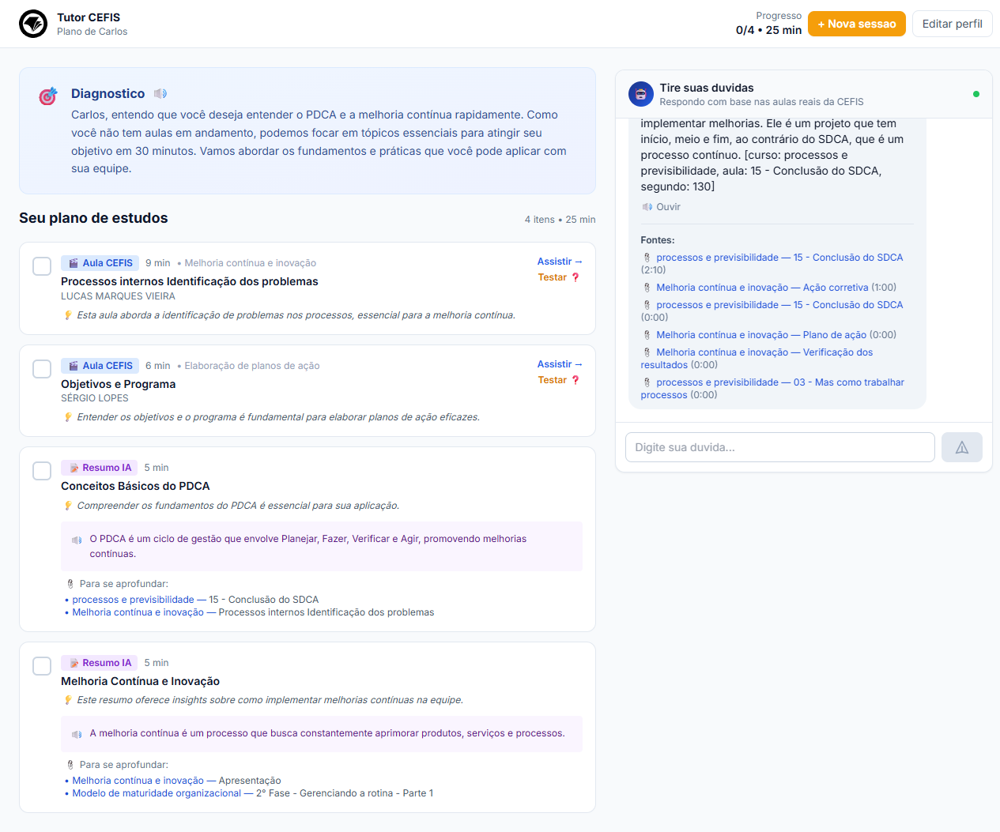</td>
  </tr>
  <tr>
    <td><b>Modal "Nova sessão"</b><br/>"Tenho X minutos agora" — gera próxima sessão respeitando o tempo atual, pulando o que já foi visto. Continua o mesmo objetivo ou troca de tema.<br/><br/>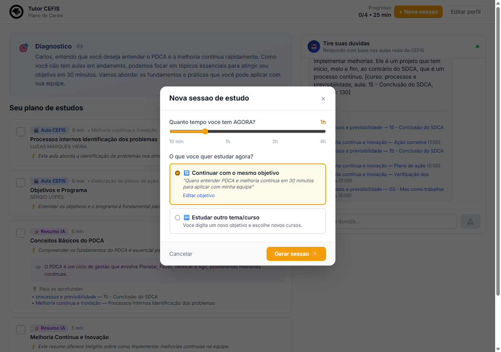</td>
    <td><b>Quiz por aula</b><br/>5 perguntas geradas em runtime da transcrição real da aula clicada. Mix de dificuldade, feedback imediato, explicação justificada no conteúdo.<br/><br/>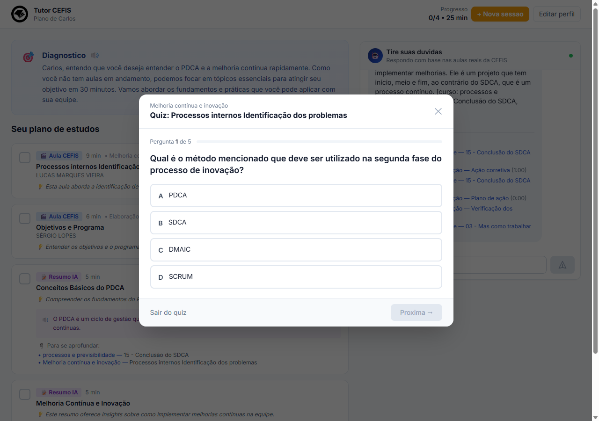</td>
  </tr>
  <tr>
    <td colspan="2"><b>Dashboard "Meu Progresso"</b><br/>Cards de stats agregados, plano atual com barra, distribuição por área, histórico das últimas sessões e quizzes recentes com nota colorida. Tudo lido do <code>localStorage</code>.<br/><br/>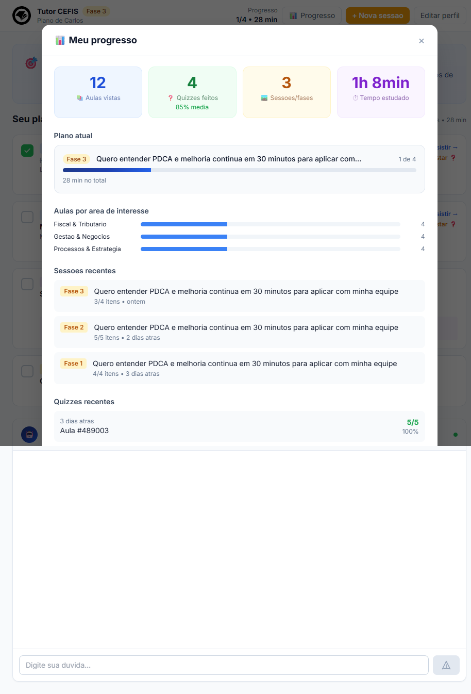</td>
  </tr>
  <tr>
    <td colspan="2"><b>Welcome screen — retomada inteligente</b><br/>Quando o aluno volta, em vez de cair no onboarding cai aqui: nome próprio, badge de fase, último plano, progresso agregado e botão grande "▶ Continuar sessão atual".<br/><br/>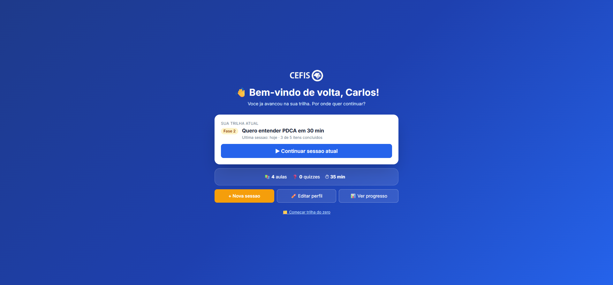</td>
  </tr>
  <tr>
    <td><b>Roleplay — escolha do cenário</b><br/>4 cenários reais prontos (CFO cético, auditoria, cliente exigente, treinamento interno) + opção de descrever cenário próprio.<br/><br/>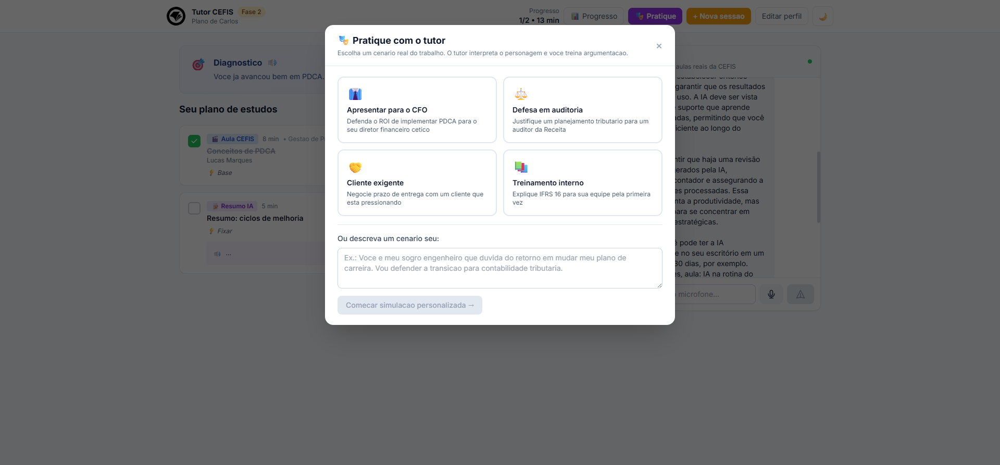</td>
    <td><b>Roleplay — simulação em andamento</b><br/>IA interpreta o personagem (CFO cético no exemplo), faz objeções concretas, mantém pressão. Aluno responde por texto ou voz.<br/><br/>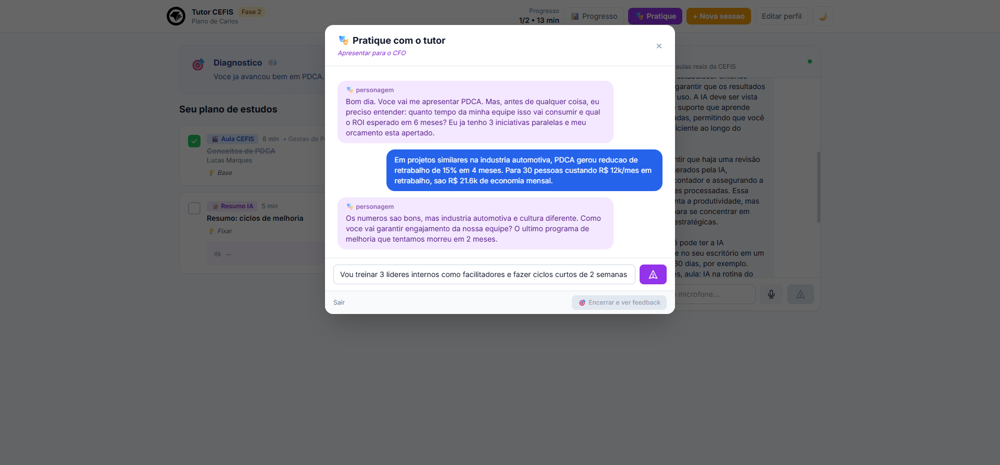</td>
  </tr>
  <tr>
    <td colspan="2"><b>Roleplay — feedback estruturado</b><br/>Nota 0-10 com cor por faixa, resumo geral, pontos fortes, pontos a melhorar e 3 aulas reais do catálogo CEFIS linkadas para aprofundar.<br/><br/>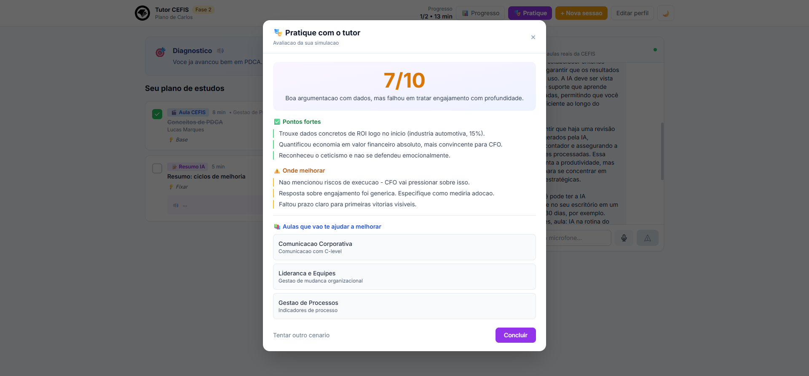</td>
  </tr>
  <tr>
    <td colspan="2"><b>Modo escuro com microfone visível</b><br/>Toggle sol/lua no header, persiste em localStorage. Botão de microfone ao lado do input do chat: Web Speech API capta voz, envia automático e a resposta toca em áudio.<br/><br/>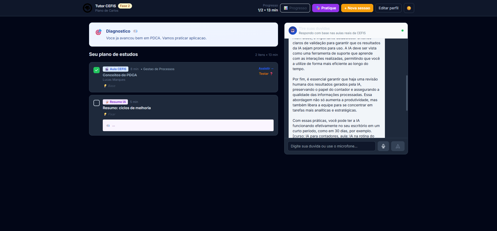</td>
  </tr>
  <tr>
    <td colspan="2"><b>Trajetória de Mestria + Insights</b><br/>Conceitos dominados = aula concluída + quiz com ≥80%. Mostra retenção real, distribuição por área e insights automáticos sobre o padrão do aluno.<br/><br/>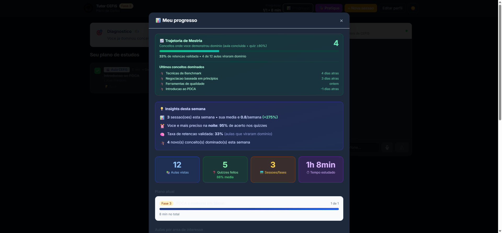</td>
  </tr>
  <tr>
    <td colspan="2"><b>Loading dinâmico com dicas rotativas</b><br/>Cada geração de plano sorteia 4 etapas de um pool de 12, incluindo etapas contextuais ("Considerando o que você já dominou" só se há conceitos dominados). Card embaixo apresenta as features em rotação.<br/><br/>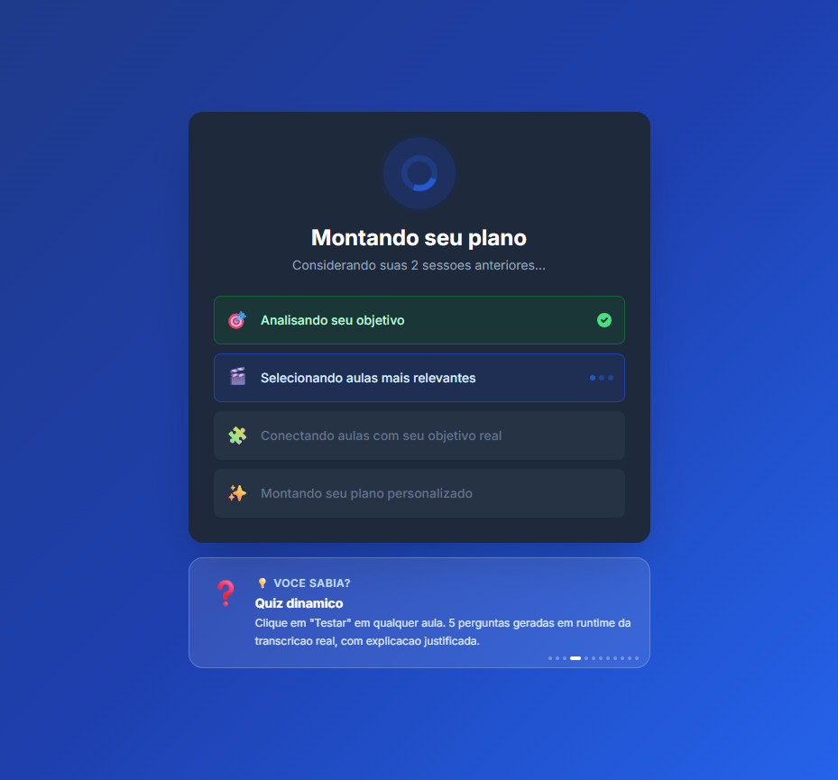</td>
  </tr>
</table>

---

## Atendimento aos requisitos do hackathon

### Entrega mínima obrigatória (briefing §4.1)

| Requisito | Implementação | Status |
|---|---|---|
| **Onboarding** — coleta perfil, objetivos, experiência e nível | Wizard de 3 passos com nome, áreas (7), objetivo livre, nível e tempo (10 min–40 h) | ✅ |
| **Diagnóstico de lacunas** — identifica o que falta para o objetivo | Prompt `DIAGNOSIS_SYSTEM` cruza objetivo + nível com top-N cursos por similaridade vetorial | ✅ |
| **Plano de estudos** — combina catálogo CEFIS + IA, respeita tempo | Prompt `PLAN_SYSTEM` monta sequência de itens `aula` (real) ou `resumo` (IA), regra de duração ≤ tempo +10% | ✅ |

### Diferenciais valorizados (briefing §4.2)

| Diferencial | Status |
|---|---|
| Geração de conteúdo original (resumos com markdown + diagramas, quiz por aula) | ✅ |
| Interação de dúvidas com material real (chat com RAG profundo) | ✅ |
| Acompanhamento contínuo (histórico + trilha multi-fase + dashboard + mestria) | ✅ |
| Interface bem projetada (branding CEFIS, persistência, modo escuro, animações) | ✅ |
| Múltiplos formatos (texto + chat + quiz + áudio TTS + voz + roleplay) | ✅ |
| Adaptação ao estilo de aprendizagem | ⚠️ parcial — auditivo coberto via TTS e voz; visual via texto, diagramas e markdown; cinestésico via quiz e roleplay. Sem auto-detecção do estilo dominante |

### Critérios de avaliação (briefing §5)

| Critério | Peso | Cobertura |
|---|---|---|
| **Funcionalidade** | 30 pts | 10/10 testes E2E automatizados, validados via Playwright headless real |
| **Integração com a CEFIS** | 25 pts | 476 cursos indexados + 5 endpoints da API real conectados (login, perfil, certificados, trilhas, progresso por aula) |
| **Qualidade da IA** | 20 pts | RAG profundo com citação obrigatória por segundo, regras anti-alucinação, streaming SSE, resumos enriquecidos |
| **Inovação** | 15 pts | Roleplay aplicado, chat por voz, autoplay do tutor, mestria validada com duas condições, loading dinâmico |
| **Experiência do usuário** | 10 pts | Logos CEFIS, modo escuro, persistência total, welcome screen, microinterações |

---

## Stack

- **Backend:** Python 3.11 + FastAPI + SQLite + sqlite-vec + OpenAI (gpt-4o-mini, text-embedding-3-small, tts-1)
- **Frontend:** HTML + Tailwind CDN + Alpine.js. Sem build.
- **Deploy:** Windows Server + IIS (URL Rewrite + ARR) + nssm + Let's Encrypt

Detalhes em [ARQUITETURA.md](ARQUITETURA.md).

---

## Quick start

```cmd
git clone https://github.com/CarlosLimaBR/CEFIS-Hackathon.git
cd CEFIS-Hackathon
powershell -Command "Expand-Archive -Path Docs\courses.zip -DestinationPath Docs\output -Force"
python -m venv .venv
.venv\Scripts\python.exe -m pip install -r requirements.txt
copy .env.example .env
notepad .env                       REM preencha OPENAI_API_KEY
indexar.bat                        REM ~25 min, ~$0.17
iniciar.bat                        REM em outro cmd
```

Acesse http://localhost:8000.

Passo a passo completo em [SETUP.md](SETUP.md). Deploy em servidor: [DEPLOY.md](DEPLOY.md).

---

## Licença

Projeto criado durante o **CEFIS Hackathon 2026**. Uso interno do hackathon.
